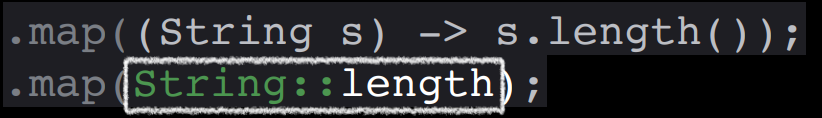

# Week 1. 효율적이면서 현대스러운 코드 작성법

Java에서 인스턴스 생성 방법은 2가지가 있다. 
1. 생성자; Constructor Method
2. 정적 팩토리 메서드; Static Factory

 

## 정적 팩토리 메서드
### 장점
1. **이름**을 가질 수 있다. `의미 전달`
    - 생성자에 전달하는 매개변수와 생성자 자체만으로는 반환될 객체의 특성을 설명하지 못함
    - 정적 팩토리는 잘 지은 이름을 통해 반환될 객체의 특성을 쉽게 묘사 가능

2. 호출될 때마다 인스턴스를 **새로 생성하지 않아도 된다.** `singleton; 메모리 효율`
    - 불변 클래스는 인스턴스를 미리 생성하거나, 새로 생성한 인스턴스를 캐싱해 재활용하는 방식으로 **불필요한 객체 생성 방지 가능**

3. 반환 타입의 **하위 타입 객체를 반환**할 수 있다. `다형성`
4. 입력 매개변수에 따라 **매번 다른 클래스의 인스턴스를 반환**할 수 있다. `SOLID의 OCP`
5. 정적 팩토리 메서드를 작성하는 시점에는 반환할 객체의 클래스가 존재하지 않아도 된다.
    - 인터페이스가 정의되어 있다면, 클래스(구현체)가 존재하지 않아도 괜찮다.

### 단점
1. 상속할 수 없다.
    - 기본 생성자의 접근제어자가 private

2. 정적 팩토리 메서드 찾기가 어렵다.
    - 일반 생성자와 다른 메서드명을 사용해, 익숙하지 않다면 찾기 쉽지 않다.
    - `from`, `of`, `valueOf`

 

## Builder 패턴
Construct 메서드를 통해 인스턴스를 생성할 때, 파라미터가 너무 많다면 어떻게 하는 게 좋을까? `Builder 패턴`

### 생성자와 정적 팩토리의 한계
1. 메서드 호출 과정에서 매개변수의 순서를 틀리거나 누락하는 `휴먼 에러`를 내포하고 있다.
2. `가독성`이 매우 현저하게 떨어진다.

### Builder 패턴의 2가지 방식
1. Builder 패턴을 클래스 내부에 직접 구현
2. Lombok 제공 어노테이션 주입

>어떤 방식을 선택하는 것이 좋을까? `상황에 따라서`
>- 요구 사항이 많다면 직접 구현하고, 그렇지 않다면 Lombok을 쓰는 것도 좋다.
>- getter, setter는 **지양하자**

 

## 불변 객체
### **불변식; Invariant**
- 프로그램이 실행되는 동안 또는 정해진 기간 동안 **반드시 만족**해야하는 조건을 말한다.  
- 변경을 허용할 수 있으나, 주어진 조건 내에서만 허용한다는 뜻이다.  
- 불변식이 지켜지고 있다면 "불변 객체"라고 표현할 수 있다.

예) "List의 경우, size의 크기는 반드시 0이상이어야 하고 절대 음수 값이 될 수 없다" 라는 조건식은 List.size()의 불변식이다.

### 불변 클래스 선언 방법
1. final 클래스 `거의 안 씀`
2. 클래스의 모든 필드를 final로 선언 (예외 존재) `클라이언트는 항상 설계자의 의도대로 행동한다`
    - 예) JDK에서 제공하는 List, Map을 사용하는 클라이언트는 개발자이고, 개발자는 주어진 인터페이스 규약을 지켜야 한다.
3. private 필드
4. 클래스의 확장(extends)를 막는다; private과 static factory `상속을 하는 순간, 설계자의 의도를 망가트려 버전 업그레이드 시 문제를 야기한다`

### 불변 객체의 특징
1. **단순**하다 `예상대로 동작`
2. 공유가 자유롭고, 동일한 불변 객체 간의 내부 데이터를 공유할 수 있다.
3. 그 자체로 **실패 원자성**을 제공한다. `연산 시 오류가 발생해도 실패한 객체는 그대로 유지`
    - **멱등성**을 지원해, 시스템 안정성을 높인다.

 

## 람다와 스트림
### 동작 파라미터화
동작(Method)을 Method의 파라미터로 전달하는 방식

> 하지만, 우리가 **함수형 인터페이스**를 많이 사용하지 않는 이유는?
> 1. 비즈니스 로직과 관련 없는 부가적인 코드가 많다.
> 2. 가독성이 나쁘다.

## 람다; Lambda
Java 8부터 추가된 기능으로, **익명 함수**를 말한다.

### 왜 중요할까?
1. Java 8부터 **함수를 값으로 취급**할 수 있다.
2. 가독성이 좋아진다.

### 어떻게 사용할 수 있을까?
1. 메서드를 함수처럼 선언하고, 변수에 할당할 수 있다.

2. 함수형 인터페이스라는 문맥에서 람다 표현식을 사용할 수 있다.

### ※ 람다를 잘 쓰려면 **함수형 프로그래밍**을 잘 알아야 한다.
람다 표현식의 문법은 굉장히 유연하다. `선언 축약` `return문 생략` `type 추론`

### 람다식 메서드 레퍼런스
실행하려는 메서드를 참조해 매개변수와 반환 타입을 알아내고, 람다식에서 불필요한 선언부를 생략할 수 있는 문법

> 람다식은 런타임에서 예외를 발생시키지만 잡을 수 없어, try-catch를 따로 해줘야한다.

 

## 스트림; Stream
데이터 처리 연산을 지원하도록 Source Data에서 추출된 연속된 요소 (Sequence of elements)

### 특징
1. **선언형** 코드 작성 `추상화; How가 아닌 What`
2. 여러 중간 연산을 연결해 데이터 처리 **파이프라인**을 만들 수 있다. `메서드 체이닝 Lazy Evaluation`

 

3. **내부 반복**을 사용한다. `성능 향상`
    - 쉬운 병렬 처리 설정
    - 락, 동기화를 자동으로 처리
    - 빠른 처리순으로 실행
    - 자동 최적화

 

### 스트림 Method

- 많은 축약이 가능하다.
- index의 타입이 Integer라는 것을 추론할 수 있다.

 

## NULL로 인해 발생하는 문제
1. 에러의 근원
2. 아무런 의미가 없음
3. null 처리를 위한 if-else문으로 가독성 저하
4. Java 철학 위배 `null만 pointer 개념을 가진다`
5. 형식 시스템에 구멍이 생김

 

### 올바른 NULL 처리 방법
Type 시스템을 이용해서 값이 없으면 빈 값을 갖게 하고, 값이 있으면 주어진 형식에 맞는 값을 갖도록 하는 방식이 좋다.

### Optional<T>
T타입의 값을 캡슐화하는 클래스
- `isPresent()` : Optional 값의 존재 여부에 따라 boolean 반환; 성능 이슈로 지양할 것
- `orElseThrow(() -> new Exception...)` : 글로벌 에러로 던져서 예외를 따로 처리할 것 

 

## 결론: 가독성, 추상화, 불변성

- 사용 전

- 사용 후

 

## Auto Boxing/Unboxing
- 기본형 타입과 래퍼 클래스 간의 자동 형변환 기능
- **성능 문제**를 일으키는 숨은 요인

스택 영역에 있는 값을 힙 영역에 올리는 과정에서 성능 상 이슈가 발생할 것이다.

Stream을 사용하면 해결할 수 있다.

 

# 질의응답
### Q1. Runnable에 비해 람다가 가지는 장점
- 가독성: 익명 클래스를 사용하지 않아 **코드 핵심**만 작성할 수 있다.
- Runnable은 스레드에서 "어떤 행동을 할지 정의"를 하는 것이며 클래스 생성자와 인터페이스 메서드를 구현해야 하지만,  
람다는 "동작" 그 자체에만 집중해 직관적일 수 있다.

### Q2. 생성자는 객체를 생성하는 명확한 의도가 드러나지만, 빌더는 강제하지 않는 파라미터의 경우 명확한 의도를 알 수 없다
- 불안전한 객체가 생성될 수 있으니 조심해야 한다. setter를 사용해야 하는 경우가 생길 수도 있다.  
빌더를 사용한다면 **디폴트 값**이 강제적으로 들어가도록 만들어야 한다.
- `@Builder.Default` 활용하기

### Q3. 실무에서는 어떤 경우에 스트림을 주로 사용하는가
- List Collection Framework를 다룰 때
